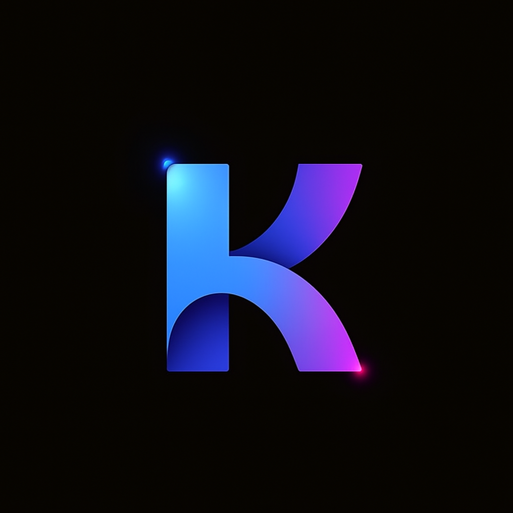

# KatestroyUI

KatestroyUI React, TypeScript, Tailwind CSS, ve Motion kullanarak, animasyonlu ve kullanımı kolay React bileşenleri sunan açık kaynaklı bir UI kütüphanesidir.

## Özellikler

- **Modern Tasarım:** Şık, güncel ve tamamen özelleştirilebilir arayüz bileşenleri.
- **Kolay Entegrasyon:** Hızlı kurulum, sade API ve kapsamlı dökümantasyon.
- **Animasyonlu Bileşenler:** Motion tabanlı animasyonlar ile canlı kullanıcı deneyimi.
- **Açık Kaynak:** MIT lisansı ile tamamen ücretsiz ve topluluğa açık.

## Dokümantasyon

Her bileşenin dokümantasyon sayfasında:

- Canlı demo
- Kod örneği
- Kurulum talimatları
- Kullanım açıklamaları
- Props tablosu

bulunmaktadır.

Daha fazla bilgi için: [KatestroyUI Dökümantasyon](https://www.katestroyui.com)

## Katkıda Bulunun

Katkılarınızı bekliyoruz! Lütfen önce [GitHub](https://github.com/emrecanberktas/Katestroyui) üzerinden bir issue açın veya pull request gönderin.

## Lisans

MIT
